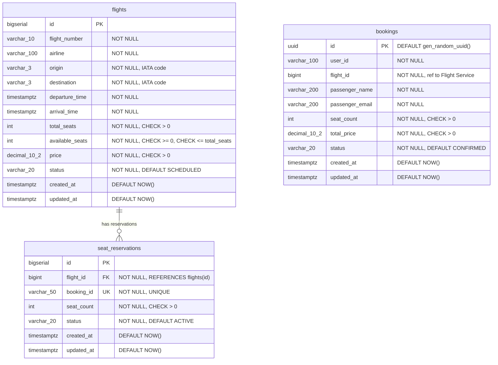

# ER-диаграмма системы бронирования авиабилетов (3NF)

## Нормализация (3NF)

Все таблицы находятся в третьей нормальной форме:

1. **1NF**: Все атрибуты атомарны, нет повторяющихся групп.
2. **2NF**: Нет частичных зависимостей — все неключевые атрибуты зависят от всего первичного ключа (который во всех таблицах — одноколоночный `id`).
3. **3NF**: Нет транзитивных зависимостей — неключевые атрибуты зависят только от первичного ключа.

## Ограничения целостности

| Ограничение | Таблица | Описание |
|---|---|---|
| `total_seats > 0` | flights | Общее количество мест строго положительно |
| `available_seats >= 0` | flights | Количество доступных мест не может быть отрицательным |
| `available_seats <= total_seats` | flights | Доступных мест не больше общего числа |
| `price > 0` | flights | Цена строго положительна |
| `UNIQUE(flight_number, departure_time::date)` | flights | Уникальность рейса по номеру и дате |
| `seat_count > 0` | seat_reservations | Количество зарезервированных мест положительно |
| `booking_id UNIQUE` | seat_reservations | Одному бронированию — одна резервация |
| `flight_id FK` | seat_reservations | Ссылочная целостность на рейс |
| `seat_count > 0` | bookings | Количество мест положительно |
| `total_price > 0` | bookings | Стоимость положительна |

## Связи между сервисами

- `seat_reservations.booking_id` ↔ `bookings.id` — логическая связь между сервисами (не FK, т.к. разные БД)
- `bookings.flight_id` ↔ `flights.id` — логическая ссылка на рейс (не FK, т.к. разные БД)
